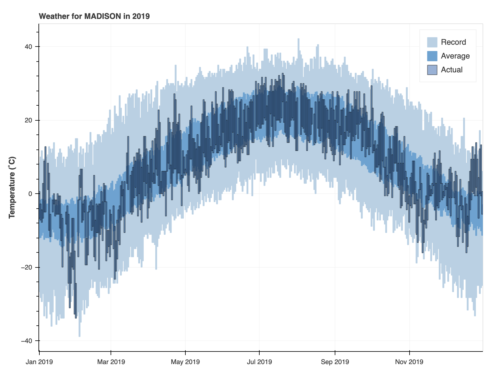

# ATMS 523 Module-3
## Climate Data Analysis with GHCN

## Wenhan Tang (UIN: 678054985)

This repository contains the Jupyter Notebook **HW3.ipynb**, which focuses on processing and analyzing daily climate data from the NOAA Global Historical Climatology Network (GHCN).

## Contents
- **Data access**: Demonstrates how to download GHCN daily data directly from the AWS public dataset.
- **Data processing**: Extracts key temperature variables (TMAX, TMIN), cleans missing values, and organizes them into analysis-ready formats.
- **Climate statistics**:
  - Record high and low temperatures for the selected station.
  - Normal (1991–2020) mean high and low temperatures.
  - Actual daily high and low temperature series.
- **Visualization**: Plots showing record, normal, and actual temperature bands for the chosen station and year.

## References

Visualization is inspired by [Bokeh Weather Demo](https://demo.bokeh.org/weather),
with code adapted from [Bokeh GitHub examples](https://github.com/bokeh/bokeh/tree/branch-3.9/examples/server/app/weather).

## Demo

